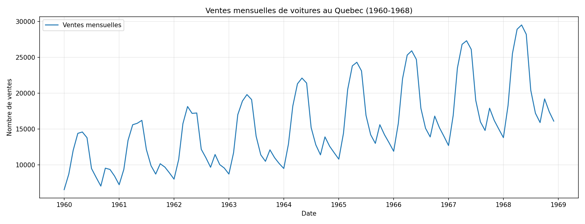
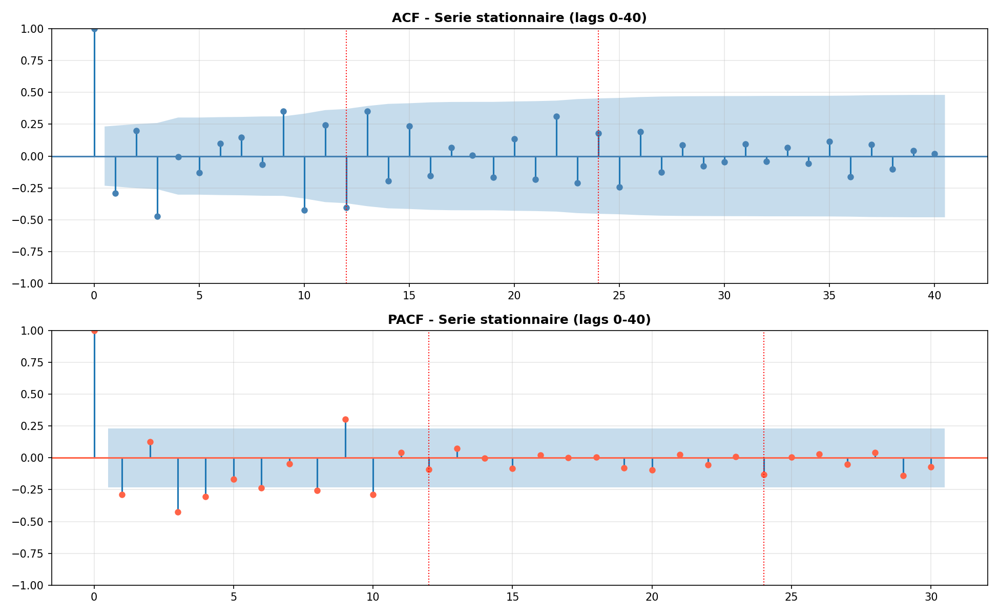
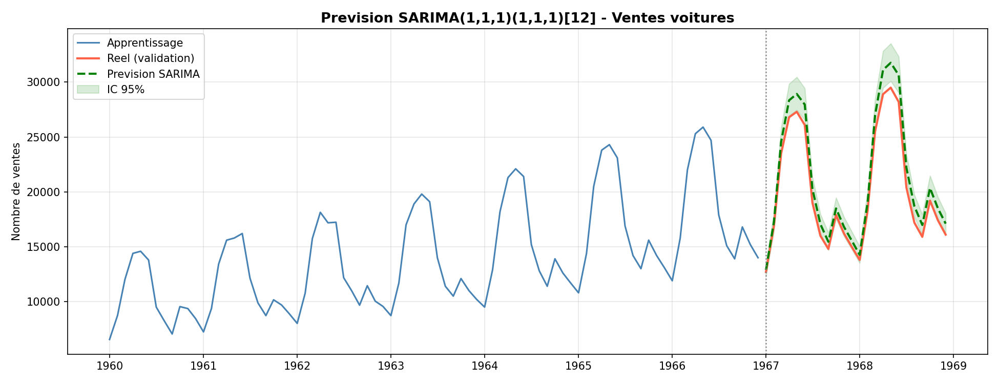

# Application de la methode de Box-Jenkins aux ventes de voitures

Projet de series chronologiques realise dans le cadre du module de Series Chronologiques a l'INSEA.

Le sujet consiste a appliquer la methode de Box-Jenkins sur une serie temporelle afin de construire un modele de prevision, de le valider sur un echantillon test, puis d'interpreter les resultats obtenus.

## Sujet

La serie etudiee represente les ventes mensuelles de voitures au Quebec entre janvier 1960 et decembre 1968. Elle contient 108 observations mensuelles.

L'objectif principal est de prevoir les ventes futures en suivant une demarche statistique complete :

- description et visualisation de la serie ;
- separation apprentissage / validation ;
- analyse de la tendance et de la saisonnalite ;
- tests de stationnarite ;
- analyse des correlogrammes ACF et PACF ;
- identification et estimation d'un modele SARIMA ;
- validation des residus ;
- evaluation des previsions.



## Methode

La serie presente une tendance croissante et une saisonnalite annuelle marquee. Une decomposition multiplicative est donc pertinente, car l'amplitude des variations saisonnieres augmente avec le niveau de la serie.

Pour rendre la serie compatible avec la methode de Box-Jenkins, le travail utilise :

- une transformation logarithmique ;
- une differenciation ordinaire ;
- une differenciation saisonniere de periode 12.

Les tests ADF et KPSS confirment que la serie transformee devient stationnaire.

Les correlogrammes ACF et PACF sont ensuite utilises pour guider l'identification du modele SARIMA et confirmer la presence d'une saisonnalite annuelle.



## Modele retenu

Le notebook principal retient le modele suivant :

```text
SARIMA(1,1,1)(1,1,1)[12]
```

Ce modele est choisi a partir d'une recherche par grille selon le critere AIC.

## Resultats

La validation est effectuee sur les 24 derniers mois de la serie, de janvier 1967 a decembre 1968.

Les performances obtenues sont :

| Indicateur | Valeur |
|---|---:|
| MAE | 1191 |
| RMSE | 1339 |
| MAPE | 5.64 % |

Le MAPE inferieur a 10 % indique une bonne qualite de prevision pour ce niveau de projet. Les previsions suivent correctement la structure saisonniere de la serie.



## Contenu du projet

- `notebooks/notebook_box_jenkins.ipynb` : notebook principal correspondant au rapport final.
- `rapport/rapport_notebook_box_jenkins.pdf` : rapport final compile.
- `rapport/rapport_notebook_box_jenkins.tex` : source LaTeX du rapport final.
- `car_sales.csv` : serie utilisee.
- `figures/` : visualisations et diagnostics du modele.
- `outputs/` : tableaux de resultats, tests et metriques.

## Conclusion

Ce projet montre comment passer d'une serie brute non stationnaire a un modele SARIMA interpretable. La demarche suit les etapes classiques de Box-Jenkins : identification, estimation, validation et prevision. Les resultats obtenus sont coherents avec la saisonnalite annuelle des ventes automobiles et donnent une base solide pour une presentation academique.
